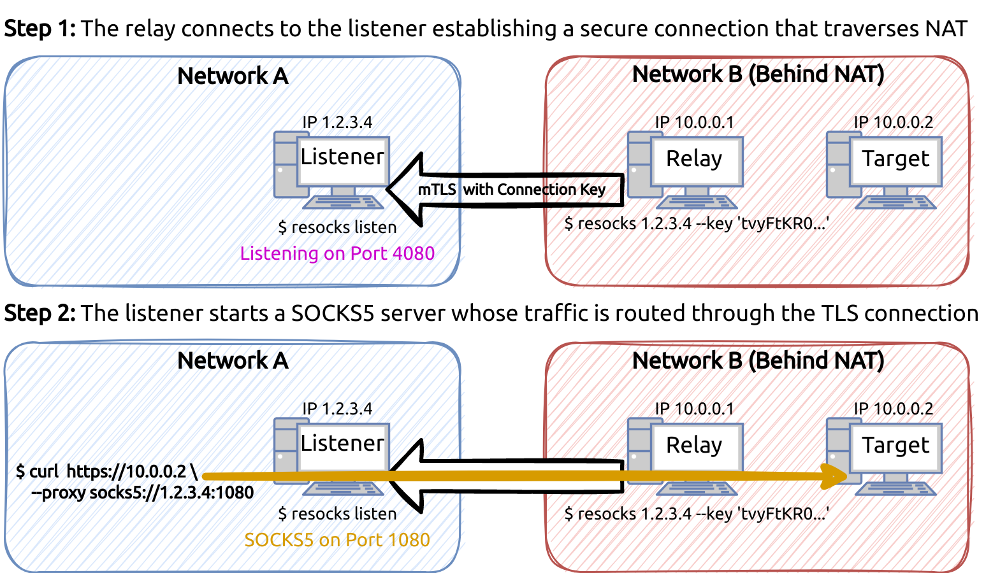
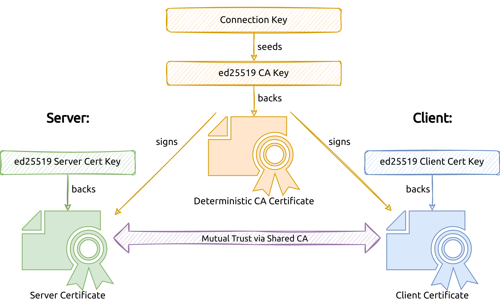

<p align="center">
  <h1 align="center"><b>resocks</b></h1>
  <p align="center"><i></i></p>
  <p align="center">
    <a href="https://github.com/RedTeamPentesting/resocks/releases/latest"></a>
    <a href="https://github.com/RedTeamPentesting/resocks/actions?workflow=Check"></a>
    <a href="/LICENSE"></a>
    <a href="https://goreportcard.com/report/github.com/RedTeamPentesting/resocks"></a>
  </p>
</p>

---

`resocks` is a reverse/back-connect SOCKS5 proxy tunnel that can be used to
route traffic through a system that can't be directly accessed (e.g. due to
NAT). The channel is secured by mutually trusted TLS with auto-generated
certificates based on a connection key.



## Usage

Start the listener on the system that acts as the entry point of the SOCKS5
tunnel:

```bash
# on proxy entry point system with IP 1.2.3.4
$ resocks listen
```

Copy the connection key and pass it to `resocks` on the relay
system:

```bash
# on remote relay system with IP 10.0.0.1
$ resocks 1.2.3.4 --key $CONNECTION_KEY
```

Now configure tools on the proxy entry point system to use the local SOCKS5
server, for example:

```bash
$ curl --proxy 'socks5://127.0.0.1:1080' 'http://10.0.0.2'
```

You can also generate a connection key with `resocks generate` and pass it to
the `listen` command to avoid generating a new connection key every time.

## Security

The threat model of `resocks` primarily takes into account attackers that can
inspect, intercept and modify traffic between the listener and the relay.
Specifically, `resocks` aims to defend against the following scenarios:

- **A: Malicious Observer:** Attackers with network access between the listener
  and the proxy should not be able to see the SOCKS5 traffic that is routed
  through the tunnel.
- **B: Malicious Listener:** When connecting the proxy to a listener, attackers
  should not be able to redirect the traffic to a malicious listener, as this
  would grant them access to the proxy server's network.
- **C: Malicious Relay:** Attackers should not be able to connect to an existing
  listener in order to be able to receive the traffic that was meant to be
  routed through the legitimate proxy.

This threat model suggests using a mutually authenticated encrypted connection
between the listener and the relay as described [here](#key-based-tls).

Please note that `resocks` is **not** designed to defend against the following
scenarios:

- **D: Malicious User on Listener System:** Malicious users on the system
  hosting the listener is generally able to connect to the SOCKS5 proxy or
  extract the connection key.
- **E: Malicious User on the Relay System:** A malicious user on the system
  hosting the relay can generally extract the connection key.

However, as described [here](#defense-in-depth), there a some defense-in-depth
measures that can employed to harden `resocks` against such attacks.

### Key-Based TLS

The tunnel between the listener and the relay is secured by a shared connection
key which is used to establish a mutually trusted TLS 1.3 connection. This works
by using the key on both sides to derive the same CA certificate which is then
used to sign the server and client certificates that are generated on the spot.
The library that implements this technique (`kbtls`) is available
[here](https://github.com/RedTeamPentesting/kbtls).



### Defense-in-Depth

When running either the `resocks` listener or relay on an untrusted system
(scenarios D/E), attackers can potentially read the connection key which
undermines the defenses against scenarios A, B and C.

By default, the connection key is passed as a command line flag and can be read
out by attackers with the permission to see process listing with arguments.
Alternatively, the connection key can be specified via environment variable
(`$RESOCKS_KEY`) or it could be statically built into the binary as described
[below](#building). In this case, the read permissions will need to be revoked
for other users. In certain scenarios, these techniques may prevent certain
low-privileged attackers from gaining access to the connection keys.

## Building

`resocks` can be built with the following command:

```bash
go build
```

In order to compile a static connection key as the default connection key
directly into the binary, use the following command:

```bash
go run . generate  # generate a connection key
go build -ldflags="-X main.defaultConnectionKey=YOUR_CONNECTION_KEY"
```
